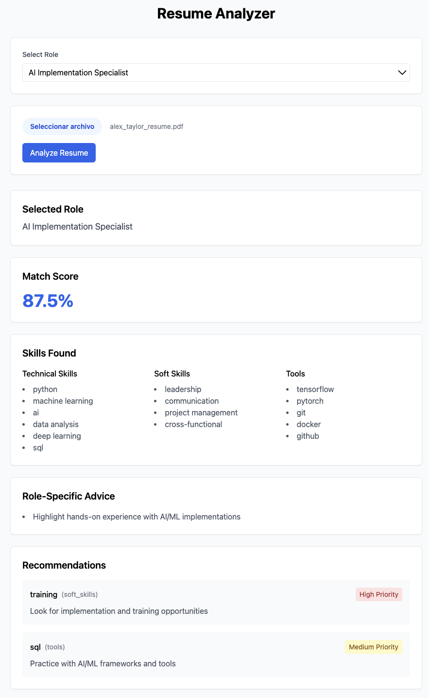
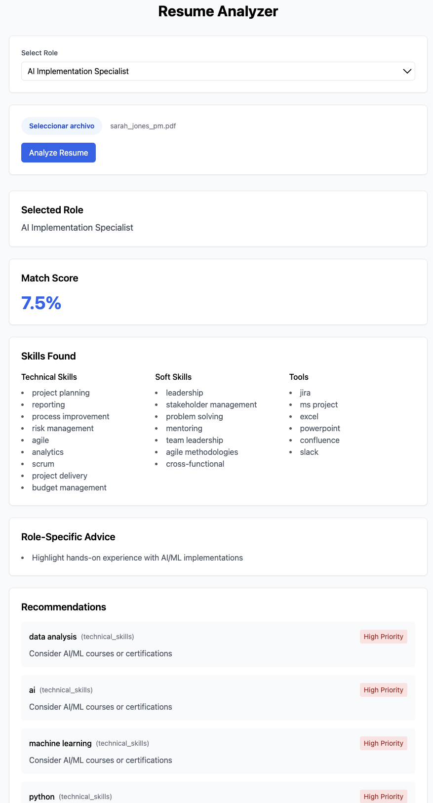

# AI CV Job Matcher


## Overview
An AI-powered CV analysis tool that matches CVs against job descriptions, using natural language processing to evaluate candidate skills and provide personalized recommendations. Currently supports AI Implementation Specialist and Project Manager roles.

## Screenshots
<div align="center">
  
  <br>
  
  <br>
  
</div>

## Features
- **CV Analysis**: Support for PDF & DOCX formats
- **Multi-Role Matching**: 
  - AI Implementation Specialist
  - Project Manager
- **Intelligent Skill Extraction**: NLP-based skill identification
- **Scoring System**: Role-specific weighted matching
- **Smart Recommendations**: Personalized skill development suggestions
- **Modern Interface**: React-based responsive UI

## Tech Stack

### Backend
- Python with FastAPI
- spaCy for NLP
- PyPDF2 and python-docx for file processing

### Frontend
- React
- Tailwind CSS
- Modern JavaScript

## Getting Started

### Prerequisites
- Python 3.8+
- Node.js and npm
- Git

### Backend Setup
```bash
git clone https://github.com/dondeerie/ai-cv-job-matcher.git
cd ai-cv-job-matcher
python -m venv venv
source venv/bin/activate  # Windows: venv\Scripts\activate
pip install fastapi uvicorn python-multipart python-docx PyPDF2 spacy
python -m spacy download en_core_web_sm
uvicorn src.api.server:app --reload --port 8001
```

### Frontend Setup
```bash
cd frontend
npm install
npm start
```

## Usage
1. Start both servers:
   - Backend: http://localhost:8001
   - Frontend: http://localhost:3000
2. Select target role
3. Upload CV (PDF/DOCX)
4. View analysis results:
   - Match score
   - Skills analysis
   - Role-specific recommendations

## Project Structure
```
ai-cv-job-matcher/
├── src/                # Backend source code
│   ├── api/           # FastAPI server
│   ├── parsers/       # CV parsing logic
│   └── matching/      # Matching algorithms
├── frontend/          # React frontend
│   ├── src/          # Frontend source
│   └── public/       # Static files
└── data/             # Sample data & resources
```

## Development Notes
- PDF and DOCX files may show slight variations in results
- Both servers must be running for functionality
- Recommended file size: < 5MB
- Currently supports AI Implementation Specialist and Project Manager roles

## Contributing
1. Fork repository
2. Create feature branch
3. Submit pull request

## License
MIT License - see [LICENSE](LICENSE)